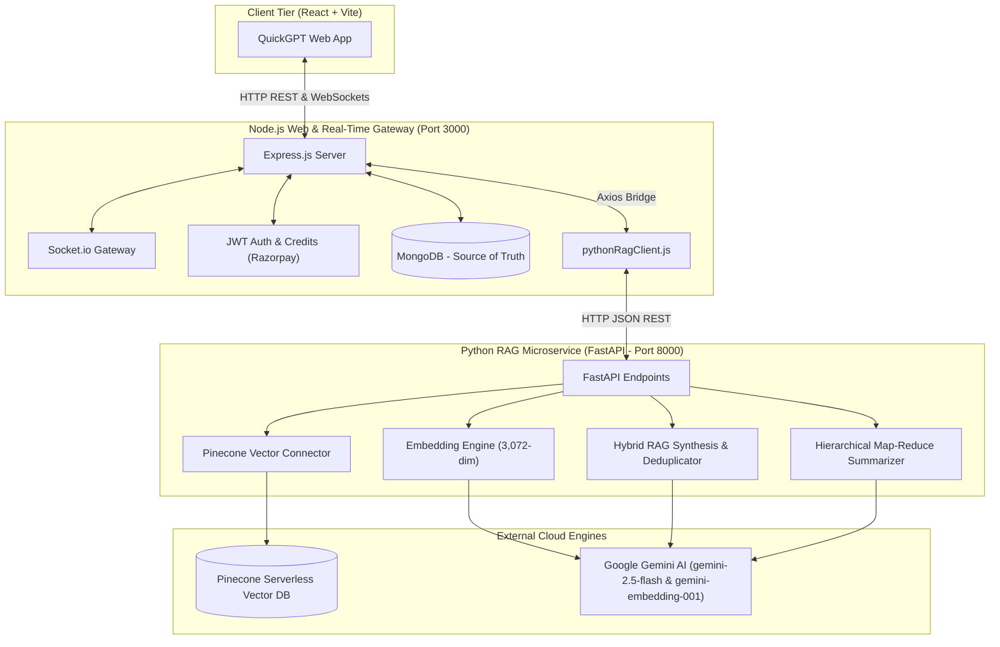

# ⚡ QuickGPT — Intelligent Collaborative AI Platform

[](https://fastapi.tiangolo.com)
[](https://nodejs.org)
[](https://react.dev)
[](https://www.pinecone.io)
[](https://ai.google.dev)
[](https://www.mongodb.com)

**QuickGPT** is a production-grade, full-stack AI platform designed for high-performance team collaboration, private conversational intelligence, and semantic long-term memory. 

It marries a real-time **Node.js + Socket.io** web tier with a dedicated, high-throughput **Python FastAPI RAG (Retrieval-Augmented Generation) microservice**, powered by **Pinecone Serverless Vector DB** and **Google Gemini (3,072-dimensional embeddings & Gemini 2.5 Flash)**.

---

## 🏛️ System Architecture



---

## 🌟 What QuickGPT Actually Does

### 1. 👥 Real-Time Collaborative Team Rooms
- **Multi-User Live Collaboration**: Users can create private or public rooms, share join links, and chat simultaneously with live presence and typing notifications via WebSockets.
- **`@ai` In-Room Assistant**: Mention `@ai` directly in any room discussion to invite the bot into the conversation. The AI responds directly in the room feed, tagging the speaker.
- **Deep Historical Recall**: The AI isn't limited by recent buffer memory. It performs cosine similarity search over months of past room discussions to recall architectural decisions, deadlines, or technical specs.

### 2. 🧠 Vector DB & Semantic RAG Microservice in Python
- **3,072-Dimensional Embeddings**: Text is sanitized, normalized, and converted into high-density vectors via Google Gemini's `gemini-embedding-001` model.
- **Isolated Namespaces**:
  - `room_{roomId}`: Isolates room chat vectors to guarantee zero data leakage between different workspaces or channels.
  - `user_{userId}`: Dedicated partition for individual private cross-session memories.
- **Context Deduplication**: Intelligently deduplicates semantic vectors against immediate chat turns so the LLM prompt never contains repetitive information.
- **Dual Bridge Resilience**: The Node.js server delegates vector processing to Python while maintaining transparent local fallback to prevent downtime if the microservice restarts.

### 3. 📊 Intelligent Room Summaries & Hierarchical Map-Reduce
- **Executive Meeting Notes**: Generates structured Markdown digests with concrete sections:
  - `## Overview`: 2–3 sentence high-level synopsis.
  - `## Key Discussion Topics`: Extracted discussion themes.
  - `## Decisions Made`: Explicit conclusions agreed upon by the team.
  - `## Action Items`: Tasks identified with owners/assignees.
  - `## Participant Contributions`: Summary of contributor inputs.
- **Hierarchical Map-Reduce**: When chat transcripts grow large (> 70 messages), QuickGPT automatically chunks the history, generates intermediate digests, and synthesizes an authoritative executive summary to eliminate context window blowout.

### 4. 🔒 1-on-1 Personal Memory & Cross-Session Recall
- **Personalized AI Companion**: Private 1-on-1 chat remembers individual user preferences (e.g., preferred coding languages, dark mode, project constraints) across distinct chat sessions.
- **Continuous Auto-Indexing**: Automatically indexes user queries and assistant answers in real time into the user's private vector space.
- **Cross-Chat Filtering**: Uses `excludeChatId` metadata filters so current session conversation is not repeated as long-term memory.

### 5. 🎨 AI Image Generation & Community Gallery
- **Text-to-Image Generation**: Turn prompts into realistic digital art and visual assets.
- **Asset CDN**: Optimized image uploads and transformations managed via ImageKit CDN.
- **Community Showcase**: Discover and explore shared AI generations from other users.

### 6. 💳 Credits, Billing & Access Control
- **Credit-Based Metering**: Granular credit deductions for AI chat, image generation, and meeting summaries.
- **Razorpay Payment Gateway**: Integrated checkout enabling users to purchase credit packs securely.
- **JWT Authentication**: Secure user registration, password hashing (`bcrypt`), and tokenized sessions.

---

## 📂 Project Structure

```
MyGPT / QuickGPT
├── client/                     # React + Vite Frontend
│   ├── src/
│   │   ├── components/         # ChatBox, Sidebar, RoomChat, Navbar, etc.
│   │   ├── context/            # AppContext (Auth, Credits, Socket state)
│   │   ├── pages/              # Home, RoomPage, RoomList, Credits, Community, Login
│   │   └── App.jsx
│   └── package.json
│
├── server/                     # Node.js + Express Backend
│   ├── configs/                # MongoDB, ImageKit, OpenAI/Gemini clients
│   ├── controllers/            # userController, chatController, summaryController, roomController
│   ├── models/                 # User, Chat, Room, RoomMessage, Summary
│   ├── routes/                 # Express REST route definitions
│   ├── socket/                 # Socket.io real-time room chat handlers
│   ├── services/
│   │   ├── pythonRagClient.js  # Node.js HTTP bridge to Python RAG service
│   │   ├── ragService.js       # Core RAG delegation and fallback layer
│   │   └── embeddingService.js # Local fallback embedding service
│   ├── scripts/                # Backfill and bridge verification tests
│   └── package.json
│
├── rag_service/                # Dedicated Python FastAPI RAG Microservice
│   ├── configs/
│   │   ├── settings.py         # Environment loader & model configurations
│   │   └── vector_db.py        # Pinecone singleton & namespace partition helpers
│   ├── services/
│   │   ├── embedding_service.py # Gemini 3,072-dim embeddings & batching
│   │   ├── rag_service.py       # Core similarity search, prompt synthesis, 1-on-1 RAG
│   │   └── summary_service.py   # Hierarchical room summarizer & topic extractor
│   ├── scripts/
│   │   └── backfill_embeddings.py # Historical MongoDB-to-Pinecone backfill script
│   ├── tests/                  # Phase 1 through Phase 6 diagnostic suites
│   ├── main.py                 # FastAPI application & REST endpoints
│   └── requirements.txt        # Python dependencies
│
└── README.md
```

---

## 🚀 Getting Started

### Prerequisites
- **Node.js** (v18.0 or higher)
- **Python** (v3.10 or higher)
- **MongoDB** (Local instance or MongoDB Atlas)
- **Pinecone Vector DB Account** (Free Serverless Tier)
- **Google Gemini API Key**

---

### 1. Environment Configuration

#### Backend & Python (`server/.env` and `rag_service/.env`)
Create a `.env` file in `server/` (and optionally in `rag_service/`):

```env
# Server Port
PORT=3000

# Database
MONGODB_URI=mongodb+srv://<username>:<password>@cluster.mongodb.net/quickgpt

# Security
JWT_SECRET=your_jwt_super_secret_key

# Google Gemini API
GEMINI_API_KEY=your_gemini_api_key

# Pinecone Vector DB
PINECONE_API_KEY=your_pinecone_api_key
PINECONE_INDEX_NAME=mygpt-index

# ImageKit (Image uploads & generation)
IMAGEKIT_PUBLIC_KEY=your_public_key
IMAGEKIT_PRIVATE_KEY=your_private_key
IMAGEKIT_URL_ENDPOINT=https://ik.imagekit.io/your_id

# Razorpay (Credit Purchases)
RAZORPAY_KEY_ID=your_razorpay_key
RAZORPAY_KEY_SECRET=your_razorpay_secret

# Python RAG Microservice Configuration
PYTHON_RAG_URL=http://127.0.0.1:8000
PYTHON_RAG_TIMEOUT_MS=15000
PYTHON_RAG_LLM_TIMEOUT_MS=60000
```

#### Frontend (`client/.env`)
```env
VITE_SERVER_URL=http://localhost:3000
```

---

### 2. Python RAG Microservice Setup

```bash
# Navigate to rag_service
cd rag_service

# Create and activate virtual environment
python -m venv venv
# Windows:
venv\Scripts\activate
# macOS/Linux:
source venv/bin/activate

# Install dependencies
pip install -r requirements.txt

# Start FastAPI Microservice on port 8000
python -m uvicorn rag_service.main:app --host 127.0.0.1 --port 8000 --reload
```

Verify service status: `http://127.0.0.1:8000/health`

---

### 3. Node.js Backend Setup

```bash
# Navigate to server
cd server

# Install dependencies
npm install

# Run database backfill (optional, to vectorize existing chats)
node scripts/backfillEmbeddings.js

# Start Node.js API & Socket server on port 3000
npm run server
```

---

### 4. React Frontend Setup

```bash
# Navigate to client
cd client

# Install dependencies
npm install

# Start Vite development server
npm run dev
```

Visit `http://localhost:5173` in your browser.

---

## 📡 Python RAG API Reference

| Method | Endpoint | Description |
| :--- | :--- | :--- |
| `GET` | `/health` | Microservice health, active phase, and feature registry |
| `GET` | `/api/rag/vector-status` | Pinecone index connectivity, dimensions, and total vectors |
| `POST` | `/api/rag/embed` | Generate 3,072-dimensional vector for a single text |
| `POST` | `/api/rag/embed-batch` | Batch vector embedding generator |
| `POST` | `/api/rag/clean-query` | Strip `@ai` tags and normalize whitespace |
| `POST` | `/api/rag/index-room-message` | Upsert room chat vector into Pinecone room namespace |
| `POST` | `/api/rag/retrieve-room-context` | Top-$K$ semantic similarity search filtered by room |
| `POST` | `/api/rag/build-room-prompt` | Deduplicated prompt synthesis combining memory & recency |
| `POST` | `/api/rag/room-chat-rag` | End-to-end room chat RAG pipeline (retrieve + prompt + Gemini) |
| `POST` | `/api/rag/room-summary` | Structured meeting summary with hierarchical map-reduce |
| `POST` | `/api/rag/index-user-message` | Upsert 1-on-1 message into user private namespace |
| `POST` | `/api/rag/retrieve-user-context` | Cross-session memory recall for a user |
| `POST` | `/api/rag/user-chat-rag` | End-to-end 1-on-1 chat RAG with auto-indexing |

---

## 🧪 Testing & Verification

QuickGPT includes end-to-end test suites across Python and Node.js:

```bash
# Run master Python test suite (Phase 1 to Phase 6)
python rag_service/tests/test_phase6.py

# Run Node.js master bridge verification
cd server && npm run test:all-rag

# Test room summaries in Node.js
cd server && npm run test:phase4-summary

# Test 1-on-1 private memory RAG in Node.js
cd server && npm run test:phase5-user-rag
```

---

## 🛡️ License

This project is licensed under the [ISC License](LICENSE).
